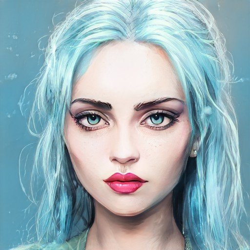

# Practica 1 Sesion 3

*Parte 1*
-
Instrucciones: 
-
1. Vas a entrar en el siguiente link -> https://colab.research.google.com/drive/1go6YwMFe5MX6XM9tv-cnQiSTU50N9EeT#scrollTo=CppIQlPhhwhs <-
	
2. Haz que la inteligencia artificial genere un video de lo que tu quieras

3. Recuerda poner lo que quieras en inglés
	
4. Espera hasta que se genere (Puede tardar hasta una hora dependiendo de las iteraciones que usaste)
	
5. Publica el video que se descargó en cualquier red social y en el formato que más prefieras
	
6. En tu publicación menciona que palabras usaste para que la IA genere eso
	
7. Etiquetar al sherpa como @brujeriatech o @josejesusguzman (Instagram) @josejesus8 (twitter) y usa los hashtags #IAWizards e #InnovaccionVirtual

Resultado:
-
Palabra para la IA: "Bitcoin"

*Parte 2*
-
Instrucciones: 
-

Ve a esta página -> https://www.artbreeder.com <-
	
1. Elige a la Waifu, Husbando o al personaje 2D de tu preferencia
	
2. Usa las imagenes dentro de la plataforma para generar tu personaje en 3D
	
3. Publica el resultado en cualquier red social y en el formato que más prefieras
	
4. Menciona que personaje es en tu post
	
5. Etiqueta al sherpa como @brujeriatech o @josejesusguzman (Instagram) @josejesus8 (twitter) y usa los hashtags #IAWizards e #InnovaccionVirtual

Resultado:
-
Personaje: "Hatsune Miku"

#
Autor: Rogelio Clemente Balderas
Programa Inovaccion Virtual 

Requisitos: 

- Sitios proporcionados.
- Poco conocimiento de Python.

#